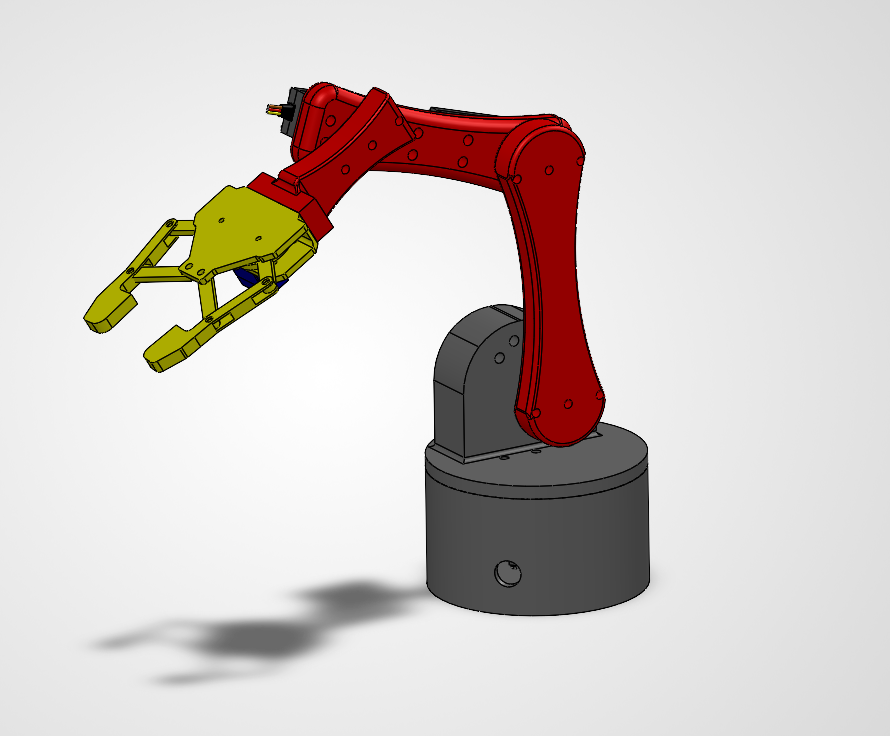
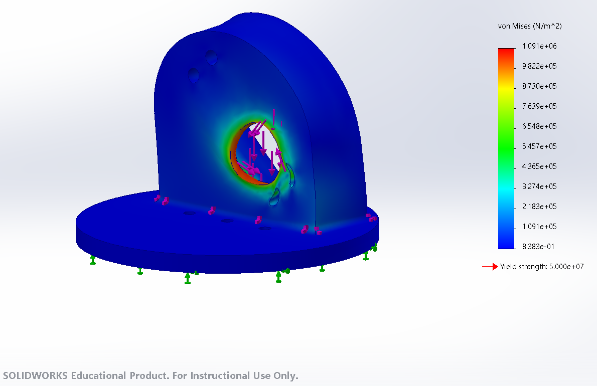

# Robotic Arm — 4-Axis Articulated Arm (Custom Design)

> A 4-DOF robotic arm designed and built from scratch — base rotation, shoulder, elbow, and wrist, plus a two-gear linkage claw gripper. 338 mm reach, servo-driven, fully 3D-printed in PLA, controlled with an inverse kinematics solver. Every joint, the base bearing, the gear train, and the actuator selection were designed around a worked torque budget rather than copied from a reference build.

**Work in progress.** Full CAD model is complete; currently printing and assembling. See [Status](#status).

<!-- REPLACE ME: full assembly render or photo of the arm.
     Save the image to /media as arm_assembly.png and it will show up here.
     A SolidWorks assembly render works now; swap in a photo once it's built. -->

*Full assembly — 4-axis arm with two-gear linkage claw gripper*

)
<!-- REPLACE ME: short clip of the arm moving, converted to GIF, saved to /media as demo.gif. -->

## Overview

A custom 4-axis arm built around the actuators on hand: four MG996R servos and one SG90 micro servo. Rather than starting from a fixed payload/reach target, I worked backward from what those servos could actually hold — the shoulder is the binding constraint, so link lengths were sized to keep it well under the MG996R's stall torque.

Two subsystems drove most of the design work. The **base rotation joint** carries the full weight and tipping moment of the arm on a dedicated bearing surface rather than on the servo's output shaft, which is rated for torque only. The **gripper** went through a full redesign — from a double rack-and-pinion to a two-gear linkage claw — after the rack version proved to depend on hardware that wasn't available.

## Status

Full CAD model complete. Currently printing and assembling.

| Part | Design | Printed |
|---|---|---|
| Base | Complete | Yes |
| Shoulder bracket | Complete | Yes |
| Upper arm | Complete | Yes |
| Forearm | Complete | Yes |
| Wrist bracket | Complete | Pending |
| Gripper — gears, arms, links, housing | Complete | In progress |

**Remaining work:**

1. Print and assemble the remaining parts; iterate on fits (see [What broke](#what-broke)).
2. Wire the arm: five servos to a PCA9685, separate 5-6 V supply, common ground.
3. Write and tune the inverse kinematics solver.
4. Measure as-built payload, grip force, and repeatability.

## Specs

| Property | Value |
|---|---|
| Degrees of freedom | 4 (base, shoulder, elbow, wrist) + gripper |
| Upper arm (shoulder to elbow) | 110 mm |
| Forearm (elbow to wrist) | 95 mm |
| Working reach | 338 mm to grasp point |
| Design payload | 75 g at full extension |
| Shoulder holding torque (worst case) | 6.44 kg·cm — 59% of MG996R stall |
| Jaw opening | 49 mm |
| Printed structure mass | ~107 g |
| Total arm mass (printed + servos) | ~256 g |
| Material | PLA throughout |

## Torque budget

The arm was sized from this rather than the other way around. Worst case is the arm held horizontal at full extension; every mass contributes a moment at the shoulder proportional to its distance from the pivot. Masses are as-sliced (4 walls, 30% infill), which is conservative — the links print at 15%.

| Item | Mass | Distance from shoulder | Moment |
|---|---|---|---|
| Upper arm | 30.2 g | 5.5 cm | 0.17 kg·cm |
| Elbow servo | 55 g | 11.0 cm | 0.61 |
| Forearm | 31.0 g | 15.4 cm | 0.48 |
| Wrist servo | 55 g | 20.5 cm | 1.13 |
| Wrist bracket | 18.2 g | 22.0 cm | 0.40 |
| Gripper assembly + SG90 | 27 g | 30.0 cm | 0.81 |
| Fasteners and hardware | ~20 g | ~15.0 cm | 0.30 |
| Payload | 75 g | 33.8 cm | 2.54 |
| **Shoulder total** | | | **6.44 kg·cm** |

This is a **static** budget — the torque required to hold position at full extension. Accelerating the arm demands more momentarily, which is what the 41% margin to stall absorbs.

## FEA — shoulder bracket

The shoulder bracket is the highest-stress printed part, so it was analyzed against the load derived above rather than an assumed one.

<!-- REPLACE ME: screenshot of the von Mises stress plot with the legend visible.
     Save to /media as fea_shoulder_bracket.png. Make sure the legend scale and the
     yield strength marker are in frame — the numbers are the point. -->

- **Setup:** static study, custom PLA material, fixed at the base flange (its bolted interface), loaded at the servo bore with 2.5 N vertical and 0.63 N·m (the 6.44 kg·cm moment in SI).

*Von Mises stress under the calculated load case. Peak stress at the servo bore; gusset roots near zero.*

- **Result:** peak von Mises stress of 1.09 MPa against PLA's 50 MPa yield — a factor of safety of roughly 46.
- **Finding:** stress at the gusset roots and the wall-to-base fillet is near zero, indicating the gussets carry the bending load as intended. The only concentration is local bearing where the load enters the bore, which is a different failure mode than the wall bending the gussets were added to prevent.
- **Limitation:** the model assumes isotropic bulk PLA. Printed parts are anisotropic — layer adhesion runs roughly 50-70% of in-plane strength — so the as-built factor of safety across layer lines is lower than reported.

## Design decisions

| Decision | Why | Result |
|---|---|---|
| 4-DOF all-servo layout (SG90 gripper + 4x MG996R) | Designed around available actuators; shoulder torque fits an MG996R at this reach and payload | Working arm without sourcing steppers |
| Link lengths sized from the shoulder torque budget | Shoulder holding the arm horizontal is the binding load | 6.44 kg·cm worst case, 41% margin to stall |
| SG90 at the gripper instead of an MG996R | Saves ~46 g at the far end of the arm, the worst place for weight | Lower shoulder torque for free |
| Rotation load on a bearing surface, not the servo shaft | Servo spline is rated for torque, not the arm's weight + tipping moment | Eliminates base wobble; servo drives rotation only |
| Rim-supported platform + center hold-down pin | Arm's center of mass sits outside the support rim, so an unpinned platform would lift and rock when extended | Rim takes weight, pin resists tipping — stable at full reach |
| Slotted horn coupling holes | The bearing should locate the platform; rigidly bolting the horn fights it and side-loads the servo | Horn transmits torque while floating radially — no binding |
| Border-frame construction on both links | Perimeter material carries the bending; hollow center saves mass out on the lever arm | Links came in at ~30 g each |
| Two-gear linkage claw over the earlier rack-and-pinion gripper | The rack design depended on smooth low-friction rails; printed plastic channels bind, and metal linear rails weren't available | A gripper built entirely from printable parts, with no sliding fits — and significantly lighter at the arm's longest lever |
| Equal-size meshing gear sectors, one driven by the servo | Meshed gears counter-rotate, so a single actuator drives both claw arms symmetrically | Both jaws close at the same rate, centering the object |
| Teeth cut only over the arc the arms sweep | The arms travel well under a full rotation, so teeth elsewhere are dead material | Less print time and material with no loss of function |
| Gussets on the shoulder bracket wall | The wall is a cantilever; arm weight tries to fold it at its root | FEA confirms near-zero stress at the gusset roots |

## Actuators & BOM

| Joint | Actuator | Notes |
|---|---|---|
| Base rotation | MG996R | Drives rotation only; load carried by the base bearing |
| Shoulder | MG996R | Binding torque constraint — sets the reach/payload limit |
| Elbow | MG996R | |
| Wrist | MG996R | Single axis (pitch) |
| Gripper | SG90 | Drives one gear sector through its horn |
| Controller | Arduino Uno + PCA9685 | PCA9685 drives all 5 servos over I2C |
| Power | Separate 5-6 V, 3 A+ supply | Common ground with the Arduino; never powered off the board |
| Fasteners | M3 bolts, nuts and washers; M2 at the gripper | Nyloc nuts at vibration-loaded joints |

## Gripper

A two-gear linkage claw driven by the SG90.

- Two meshing gear sectors of equal size sit side by side, so driving one rotates the other in the opposite direction at the same rate. The SG90 drives one through its horn.
- Each gear carries a claw arm, and each arm is tied to a link, so the two arms open and close in mirror. Symmetric motion centers the object between the jaws rather than pushing it to one side.
- Equal gear sizes give a 1:1 ratio, so both arms sweep the same angle for a given servo input.
- Teeth are cut only over the arc the arms actually travel — a gear sector rather than a full gear.
- Jaw opening: 49 mm.

Because the arms pivot on the gear axes, the jaw faces tilt as they close — this grips like pliers rather than clamping flat. Parallel closing was a property of the earlier rack design that was traded away for printability.

## Control

Five servos driven from a PCA9685 over I2C, commanded by an Arduino Uno. Target end-effector positions are resolved to joint angles by an inverse kinematics solver rather than commanding each joint by hand — the base handles yaw, and the shoulder, elbow, and wrist solve as a planar chain within the plane the base points at.

## Print settings

All PLA.

| Part | Walls | Infill |
|---|---|---|
| Base | 4 | 30% gyroid |
| Rotating platform | 4 | ribbed (solid rim and hub) |
| Shoulder bracket | 4 | 30% gyroid |
| Upper arm | 4 | 15% |
| Forearm | 3 | 15% |
| Wrist bracket | 4 | 25-30% |
| Gripper housing | 4 | 20% |
| Gear sectors | 4 | 40%+ |
| Claw arms | 4 | 40-50% |
| Links | 4 | 50%+ |

Two rules used throughout: **walls carry load, infill fills space** — perimeters go up before infill on anything that feels weak. And **print orientation beats every other setting** — links flat along their length, gear teeth in-plane rather than stacked as layer edges.

## What broke

**Modeled clearances don't survive contact with the printer.** The recurring lesson of this build: gaps and fits come out tighter than modeled, because extruded plastic spreads slightly and layer lines encroach on nominal dimensions. Three instances so far:

- The claw arm's 3 mm center gap prints under 3 mm — layer lines intrude into the opening, closing it up enough to interfere. Needs to be opened up in CAD to land at 3 mm as printed.
- The SG90 push-fit pocket in the gripper housing came out too tight.
- On the earlier rack-and-pinion gripper, the rack channels and pinion pocket were both too tight to move freely.

The fix in every case is the same: model the clearance larger than the target, and print a test coupon of any fit before committing to a full part.

**Sliding fits in printed plastic were the wrong approach for the gripper.** The original design used two racks sliding in channels on opposite sides of a driven pinion. In practice the printed channels bound against the racks. Opening the clearances would have traded binding for backlash — the design really wanted metal linear rails, which weren't available. Rather than tune a fit that was fighting the process, I replaced the mechanism with a two-gear linkage claw, which achieves symmetric jaw motion using only rotating joints and no sliding surfaces. It also came out considerably lighter, which bought back shoulder torque margin at the longest lever on the arm.

**The wrist bracket was too short** in its first revision — the gripper couldn't clear the forearm through the full pitch range. Lengthened, with the final dimension set by the clearance check rather than chosen.

## v2 ideas

Brainstorms collected while researching, not committed work:

- **NEMA17 stepper motors** in place of hobby servos, for true repeatability and higher payload.
- **Cycloidal gearboxes** at the major joints — a cycloidal reducer trades motor speed for torque in a single high-ratio stage with very low backlash, which should give smoother motion than servo-grade positioning allows.

## License

MIT — see [LICENSE](LICENSE).
